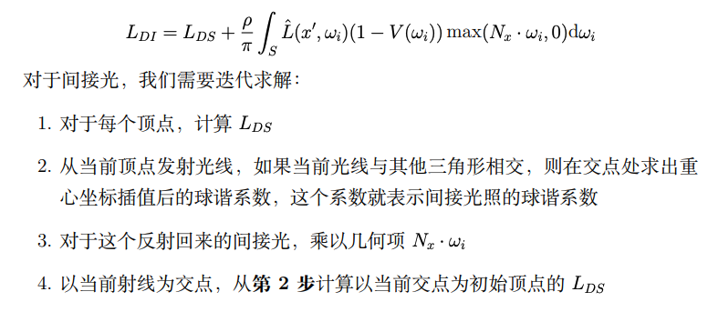
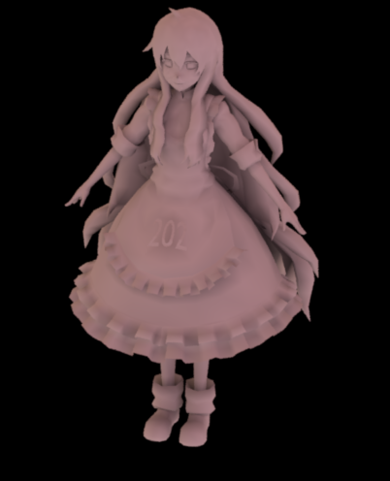
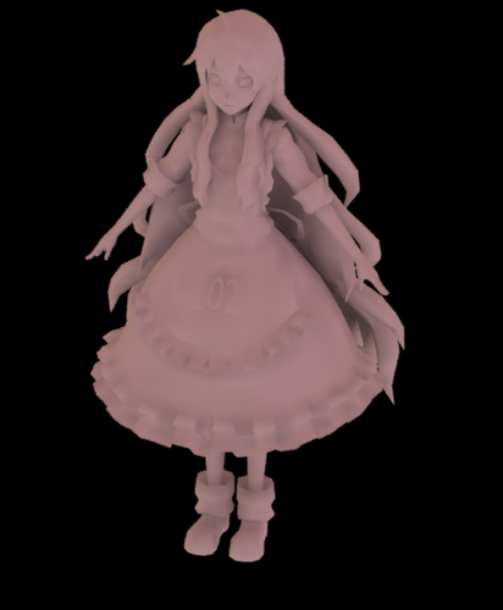
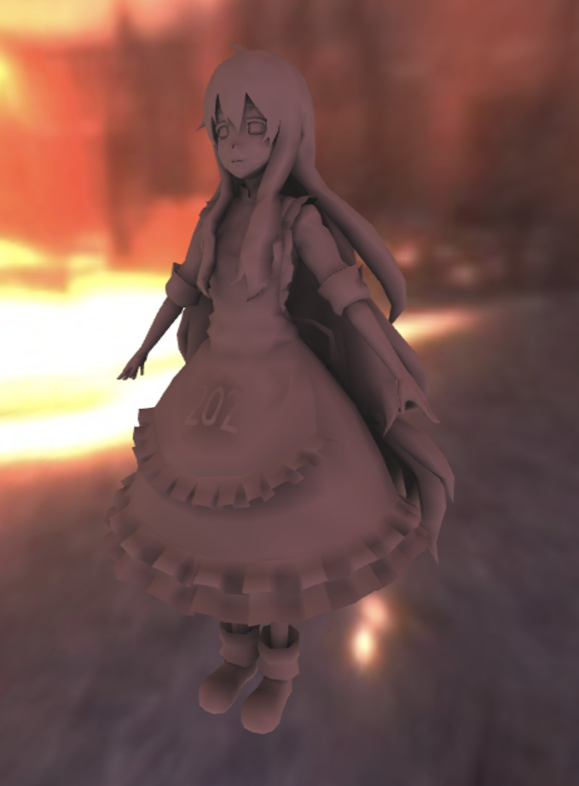
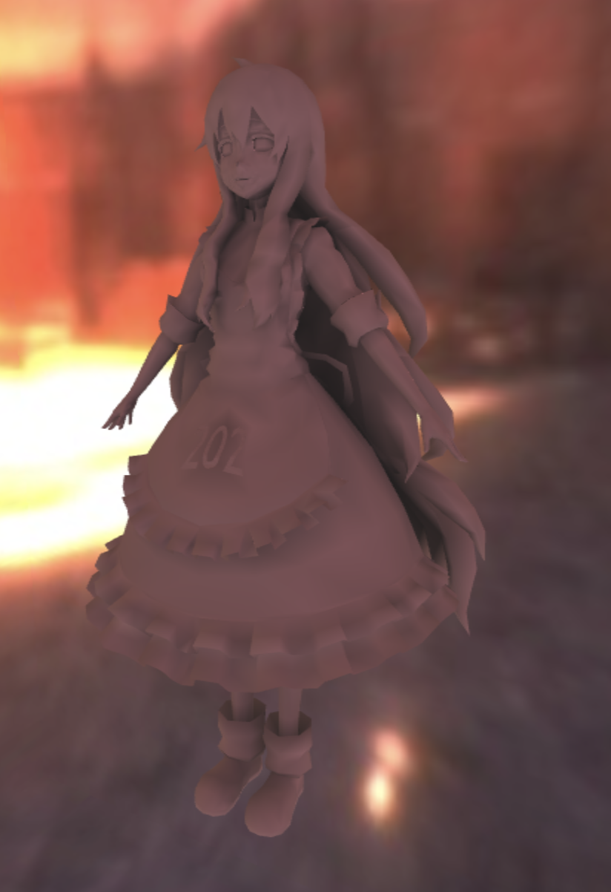

# hmw2


$$
L(w_o) = \int_{\Omega}L(w_i)V(w_i)\rho(w_i,w_o) max(0, n·w_i)dw_i
$$
$V(w_i)$ 是shading point的可见性；$\rho(w_i,w_o) $是BRDF项，因为只考虑漫反射，所以可以提取为常数项$c/\pi$。

传输项函数的表达式为：
$$
T_i = V(w_i)max(0, n·w_i)
$$
环境光照函数$L(w_i)$，没有对应的数学表达式，其输入采样向量，采样环境光贴图作为返回值。

$L(w_i)$项位置无关？

需要做的是将这两个函数分别投影到球谐函数上，求出对应系数并存储到矩阵里，在渲染时使用，化积分为点乘。
$$
L_? = \sum_{i=0}^{n} L_i T_i
$$

* m_LightCoeffs ：记录环境光的球谐系数，以rgb的形式存储，是大小 3 x (l+1)^2的矩阵，每列存储每个环境光系数的rgb值；

* m_TransportSHCoeffs： 记录传输项系数，是大小(l+1)^2 x 顶点数量的矩阵，(i , j) 存储第j个顶点的第i个系数。


## Project :

### 计算环境光系数

第一步需要在PrecomputeCubemapSH函数完成对环境光系数的求解。

```c++
auto envCoeffs = ProjEnv::PrecomputeCubemapSH<SHOrder>(images, width, height, channel);
```

EvalSH 函数即 $Y_{lm}(\theta, \varphi)$ , 计算每个单位方向向量对应的基函数值

 ```c++
 double EvalSH(int l, int m, const Eigen::Vector3d& dir) 
 ```

对于cubemap6个面的每一个纹素，计算其对每一个系数的贡献。其中第l阶第m个系数对应数组序号可参考源码里的GetIndex函数。

```c++
constexpr int GetIndex(int l, int m) {
  return l * (l + 1) + m;
}
```

？ CalcArea立体角

```c++
	for (int i = 0; i < 6; i++)
	{
		for (int y = 0; y < height; y++)// 遍历每个纹素
		{
			for (int x = 0; x < width; x++)
			{
				// TODO: here you need to compute light sh of each face of cubemap of each pixel
				// TODO: 此处你需要计算每个像素下cubemap某个面的球谐系数
				Eigen::Vector3f dir = cubemapDirs[i * width * height + y * width + x];// 归一化的单位向量
				int index = (y * width + x) * channel;
				Eigen::Array3f Le(images[i][index + 0], images[i][index + 1],
					images[i][index + 2]);

				for (int l = 0; l < SHOrder; l++) {
					for (int m = -l; m <= l; m++) {
						float sh = sh::EvalSH(l, m, dir.cast<double>().normalized());
						float delta = CalcArea(x, y, width, height);
						SHCoeffiecents[l * (l + 1) + m] += Le * sh * delta;// 黎曼和求积分
					}
				}
			}
		}
	}
```

### 计算传输项系数

shFunc 是传输项函数，是需要被投影到球谐函数上的方程。

```c++
auto shCoeff = sh::ProjectFunction(SHOrder, shFunc, m_SampleCount);
for (int j = 0; j < shCoeff->size(); j++){
  	m_TransportSHCoeffs.col(i).coeffRef(j) = (*shCoeff)[j];
}
```

```c++
// Fit the given analytical spherical function to the SH basis functions
// up to @order. This uses Monte Carlo sampling to estimate the underlying
// integral.
std::unique_ptr<std::vector<double>> ProjectFunction(
    int order, const SphericalFunction& func, int sample_count);
```

unshadowed和shadowed没啥好说，翻译公式填到shFunc里就行；

```c++
				if (m_Type == Type::Unshadowed)
				{
					// TODO: here you need to calculate unshadowed transport term of a given direction
					// TODO: 此处你需要计算给定方向下的unshadowed传输项球谐函数值
					return std::max(float(0.), wi.dot(n));
				}
				else
				{
					// TODO: here you need to calculate shadowed transport term of a given direction
					// TODO: 此处你需要计算给定方向下的shadowed传输项球谐函数值
					double H = wi.dot(n);
					return (H > 0 && !(scene->rayIntersect(Ray3f(v, wi.normalized()))))? H : 0;
				}
```

而对于interrelection的情况，文档里给出的步骤如下：



> it recursively adds in light not arriving directly from a light source, but as secondary reflected light from other polygons visible to a point on the model.

> Linearly interpolate the SH functions at each corner of the triangle using the barycentric coordinates of the hit. 

<center > <p style="color:#A9A9A9;">
  左shadowed，右interreflection = 2
  </p></center>

### 旋转


## Reconstruct

直接翻译公式3，在vertex shader里计算颜色，经插值后传递给fragment shader即可。

```glsl
attribute mat3 aPrecomputeLT;

uniform mat3 uPrecomputeLR;
uniform mat3 uPrecomputeLG;
uniform mat3 uPrecomputeLB;

varying vec3 vColor;

void main(void) {
    vColor = vec3(0.0);
    for(int i = 0; i < 3; i++){
        for(int j = 0; j < 3; j++){
            vColor += aPrecomputeLT[i][j] * vec3(uPrecomputeLR[i][j], uPrecomputeLG[i][j], uPrecomputeLB[i][j]);
        }
    }
    gl_Position = uProjectionMatrix * uViewMatrix * uModelMatrix * vec4(aVertexPosition, 1.0);
}
```


<center > <p style="color:#A9A9A9;">
  左shadowed，右interreflection self- shadow稍亮
  </p></center>


🦄️

[https://www.cse.chalmers.se/~uffe/xjobb/Readings/GlobalIllumination/Spherical%20Harmonic%20Lighting%20-%20the%20gritty%20details.pdf](https://www.cse.chalmers.se/~uffe/xjobb/Readings/GlobalIllumination/Spherical Harmonic Lighting - the gritty details.pdf)
